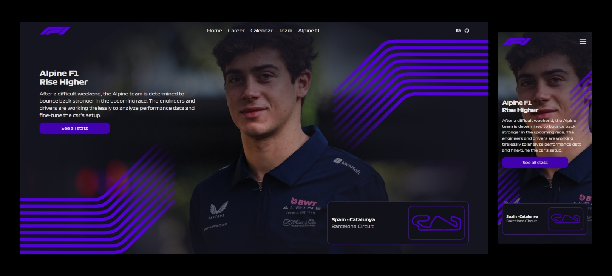

# 🏁 F1 News App

Este es un proyecto personal desarrollado para practicar habilidades con **React** y **Tailwind CSS**. La aplicación simula una página de noticias dedicada al mundo de la Fórmula 1. Se enfoca en la creación de componentes reutilizables, diseño responsivo y mapeo de datos para mostrar contenido dinámico.

---

## 🛠 Tecnologías utilizadas

- ⚛️ **React (Vite)** — Framework moderno para construir interfaces interactivas.
- 💨 **Tailwind CSS** — Librería de utilidades CSS para diseño rápido y adaptativo.
- 🧩 **Componentes dinámicos y reutilizables** — Mejora la organización del código.
- 🔄 **Uso de props y `.map()`**
- 📱 **Responsive Design** — Adaptado a móviles, tabletas y escritorios.

---

## 🧭 Funcionalidad

La aplicación muestra noticias de F1 con:

- 🖼 Imagen destacada del evento o piloto
- 📰 Título y descripción de la noticia
- Vista previa del circuito

---

## 💡 Lecciones aprendidas

- Cómo iniciar un proyecto React con Vite
- Aplicación de estilos responsivos con Tailwind
- División lógica en componentes reutilizables
- Paso de datos entre componentes mediante props
- Uso de `.map()` para renderizado dinámico de contenido

---

## 📸 Vista previa



https://delicate-tiramisu-08b525.netlify.app/


```bash
📍 Ejemplo:
./assets/preview.png
